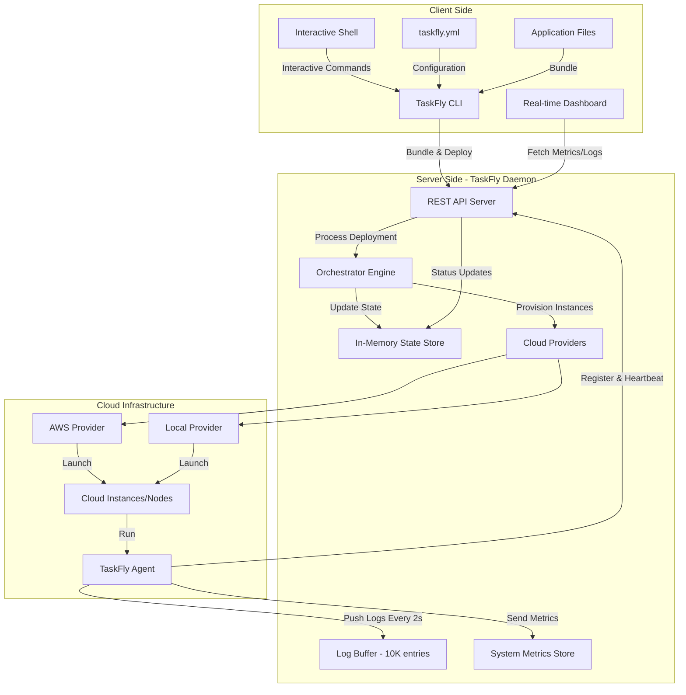
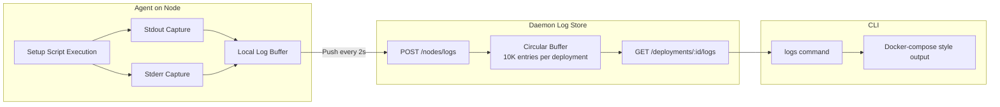

# TaskFly Architecture

## Overview

TaskFly is a distributed task orchestration system consisting of a daemon (server), CLI (client), and agent that work together to deploy and manage applications across cloud infrastructure. The system provisions cloud instances, distributes application bundles, manages the lifecycle of distributed workloads, and provides real-time monitoring through distributed logging and metrics collection.

## System Components



---

## State Management Architecture


---

## Cloud Provider Architecture


### Resource Pool Benefits
- **Cost Optimization**: Reuse instances instead of constant create/destroy cycles
- **Faster Provisioning**: Pre-warmed instances reduce startup time
- **Idle Management**: Automatic cleanup of unused instances after timeout
- **Provision-Ahead**: Proactively create instances to reduce wait times

---

## API Endpoints

### Deployment Endpoints
```
POST   /api/v1/deployments          Create new deployment
GET    /api/v1/deployments          List all deployments
GET    /api/v1/deployments/:id      Get deployment status
DELETE /api/v1/deployments/:id      Terminate deployment
POST   /api/v1/deployments/:id/cleanup   Cleanup deployment files
POST   /api/v1/cleanup/all          Cleanup all completed deployments
```

### Node Endpoints
```
POST   /api/v1/nodes/register       Register node with provision token
GET    /api/v1/nodes/assets         Download application bundle
POST   /api/v1/nodes/heartbeat      Send heartbeat with system metrics
POST   /api/v1/nodes/status         Update node status
POST   /api/v1/nodes/logs           Push logs from node
```

### Monitoring & Observability Endpoints
```
GET    /api/v1/deployments/:id/logs Fetch logs for deployment (with filters)
GET    /api/v1/metrics              Get system metrics summary and per-node data
GET    /api/v1/health               Health check
GET    /api/v1/stats                Get daemon statistics
```

---

### Why Two Bundles?

1. **Client Bundle** (`bundle.tar.gz`): Contains `taskfly.yml` + application files
   - Sent from CLI to daemon
   - Used for orchestration configuration

2. **Worker Bundle** (`worker_bundle.tar.gz`): Contains only application files
   - Created by daemon after parsing config
   - Distributed to nodes (nodes don't need taskfly.yml)
   - Keeps node bootstrap minimal

---

## Metadata Distribution


### Metadata Types

1. **Global Metadata**: Shared across all nodes
   ```yaml
   global_metadata:
     database_url: "postgres://..."
     api_key: "secret123"
   ```

2. **Distributed Lists**: Values split across nodes (round-robin)
   ```yaml
   distributed_lists:
     worker_ids: [1, 2, 3, 4, 5]  # Node 0 gets 1, Node 1 gets 2, etc.
     regions: ["us-west", "us-east"]  # Cycles through
   ```

3. **Config Template**: Static per-node configuration
   ```yaml
   config_template:
     memory_limit: "2G"
     timeout: 300
   ```

---

## Concurrency & Parallelism

### Concurrent Operations


### Key Concurrency Patterns

1. **Asynchronous Deployment**: Deployment processing happens in background goroutine
2. **Parallel Node Provisioning**: Each node provisioned concurrently
3. **Thread-Safe State**: All state updates protected by sync.RWMutex
4. **Non-Blocking Cleanup**: File cleanup happens in background after termination

---

## Security Model


### Security Flow

1. **Provision Token**: One-time use token embedded in instance user-data
2. **Auth Token**: Long-lived token generated after registration
3. **Token Validation**: All node requests validate auth token
4. **No Persistence**: Tokens stored in-memory only (daemon restart = new tokens)

---

## Failure Handling


### Failure Scenarios

1. **Node Provision Failure**: Node marked as failed, deployment continues
2. **Node Heartbeat Timeout**: Detected by monitoring (future enhancement)
3. **Script Execution Failure**: Node reports failed status
4. **Deployment Failure**: If any node fails, entire deployment marked failed
5. **Partial Success**: Some nodes complete, others fail = deployment failed

---

## Extension Points

### Adding a New Cloud Provider

1. Implement the `Provider` interface in [internal/cloud/provider.go](../internal/cloud/provider.go)
2. Add provider initialization in `Orchestrator.createProvider()` in [internal/orchestrator/engine.go](../internal/orchestrator/engine.go)
3. Update `ProviderFactory.NewProvider()` in [internal/cloud/provider.go](../internal/cloud/provider.go)

```go
type Provider interface {
    ProvisionInstance(ctx context.Context, config InstanceConfig) (*InstanceInfo, error)
    GetInstanceStatus(ctx context.Context, instanceID string) (string, error)
    TerminateInstance(ctx context.Context, instanceID string) error
    GetProviderName() string
}
```

### Adding New API Endpoints

1. Add route in [cmd/taskflyd/main.go](../cmd/taskflyd/main.go) `runDaemon()` function
2. Implement handler function in same file
3. Update state via `Store` methods in [internal/state/store.go](../internal/state/store.go)

---

## Performance Characteristics

| Operation                   | Scalability      | Notes                              |
|-----------------------------|------------------|------------------------------------|
| Deployment Creation         | O(n) nodes       | Linear with node count             |
| Node Provisioning           | Parallel         | All nodes provisioned concurrently |
| State Lookups               | O(1)             | HashMap-based store                |
| Heartbeat Updates           | O(1)             | Direct node lookup                 |
| Deployment Completion Check | O(n) nodes       | Scans all nodes per status update  |
| Cleanup                     | O(d) deployments | Linear with deployment count       |

### Bottlenecks

1. **In-Memory State**: Limited by RAM, no persistence
2. **Cloud Provider Rate Limits**: Parallel provisioning may hit API limits
3. **Bundle Transfer**: Network bandwidth for large bundles
4. **Completion Check**: Currently scans all nodes on every status update

---

## Dependencies

### Core Libraries
- **Echo**: HTTP web framework
- **Logrus**: Structured logging
- **urfave/cli**: CLI argument parsing
- **AWS SDK**: AWS provider implementation
- **YAML**: Configuration parsing

### Standard Library Usage
- `archive/tar` & `compress/gzip`: Bundle handling
- `sync`: Concurrency primitives (RWMutex)
- `context`: Cancellation and timeouts
- `crypto/rand`: Token generation
- `net/http`: HTTP client/server

---

## Distributed Logging Architecture



### Logging Features
- **Real-time streaming**: Logs pushed from agents every 2 seconds
- **Docker-compose style output**: Color-coded node names with log messages
- **Stream separation**: Stdout and stderr tracked separately
- **Circular buffer**: 10,000 entries per deployment (automatic old log pruning)
- **Follow mode**: Real-time log tailing with `--follow` flag
- **Node filtering**: View logs from specific nodes with `--node` flag
- **Timestamp tracking**: Incremental fetch using `since` parameter

---

## System Metrics Collection

```mermaid
graph LR
    subgraph "Agent Metrics Collection"
        ProcFS[/proc filesystem]
        CPUCount[CPU Core Count]
        LoadAvg[Load Averages]
        MemInfo[Memory Usage]
        Heartbeat[Heartbeat Payload]
    end

    subgraph "Daemon Metrics Store"
        MetricsAPI[POST /nodes/heartbeat]
        NodeMetrics[Per-Node Metrics]
        Summary[Aggregated Summary]
        MetricsEndpoint[GET /metrics]
    end

    subgraph "CLI Dashboard"
        DashCmd[dashboard command]
        SystemPanel[System Resources]
        DeployPanel[Deployment Overview]
        NodeTable[Node Metrics Table]
    end

    ProcFS --> CPUCount
    ProcFS --> LoadAvg
    ProcFS --> MemInfo
    CPUCount --> Heartbeat
    LoadAvg --> Heartbeat
    MemInfo --> Heartbeat
    Heartbeat --> MetricsAPI
    MetricsAPI --> NodeMetrics
    NodeMetrics --> Summary
    Summary --> MetricsEndpoint
    MetricsEndpoint --> DashCmd
    DashCmd --> SystemPanel
    DashCmd --> DeployPanel
    DashCmd --> NodeTable
```

### Collected Metrics
- **CPU Cores**: Total CPU cores available on node
- **Load Averages**: 1, 5, and 15 minute load averages
- **Memory**: Total and used memory (in GB)
- **Timestamp**: Last metrics update time

### Metrics Aggregation
- **Total Cores**: Sum of all node CPU cores
- **Average Load**: Mean load across all nodes
- **Total Memory**: Sum of memory across all nodes
- **Active Nodes**: Count of nodes with recent metrics

---

## CLI Features

### Interactive Shell
TaskFly provides an interactive REPL shell for managing deployments:

```bash
taskfly shell
```

**Available Commands:**
- `dashboard, dash` - Show real-time dashboard (auto-refreshes every second)
- `list, ls` - List all deployments
- `status <id>` - Show detailed deployment status
- `logs <id> [--node <node-id>] [--follow]` - View and follow logs
- `up, deploy` - Deploy from taskfly.yml
- `down <id>` - Terminate deployment
- `clear` - Clear screen
- `help` - Show help
- `exit, quit` - Exit shell

### Real-time Dashboard
The dashboard provides live visibility into your TaskFly cluster:

```bash
taskfly dashboard  # Standalone mode (refreshes every second)
# Or within shell:
taskfly> dashboard
```

**Dashboard Sections:**
1. **System Resources**: CPU cores, load average, memory usage, active nodes
2. **Deployment Overview**: Total, running, provisioning, completed, and failed counts
3. **Recent Deployments**: Last 5 deployments with progress bars
4. **Node Metrics**: Per-node CPU, load, memory, and last update time

**Color Coding:**
- Green: Healthy (< 70% utilization)
- Yellow: Warning (70-90% utilization)
- Red: Critical (> 90% utilization)

### Log Streaming
View logs from your deployments in real-time:

```bash
# View all logs
taskfly logs --id <deployment-id>

# Follow logs (like tail -f)
taskfly logs --id <deployment-id> --follow

# Filter by specific node
taskfly logs --id <deployment-id> --node <node-id>
```

---

## Monitoring & Observability

### Daemon Logging
- Structured logs via Logrus
- Log levels: Debug, Info, Warn, Error
- Key events logged:
  - Deployment lifecycle
  - Node registration
  - Provisioning status
  - Cleanup operations
  - Log ingestion
  - Metrics collection

### Agent Logging
- Captures stdout/stderr from setup scripts
- Buffers logs locally before pushing
- Pushes logs every 2 seconds
- Includes stream type (stdout/stderr) and timestamp

### Available Statistics (via /stats endpoint)
```json
{
  "total_deployments": 5,
  "total_nodes": 25,
  "deployment_status": {
    "running": 2,
    "completed": 3
  },
  "uptime": "2h30m15s"
}
```

### Available Metrics (via /metrics endpoint)
```json
{
  "summary": {
    "total_cores": 16,
    "total_memory_gb": 64.0,
    "total_memory_used_gb": 32.5,
    "avg_load": 4.2,
    "nodes_with_metrics": 4
  },
  "nodes": [
    {
      "node_id": "node-001",
      "status": "running",
      "last_update": "2024-01-15T10:30:00Z",
      "metrics": {
        "cpu_cores": 4,
        "load_avg_1": 1.2,
        "load_avg_5": 1.5,
        "load_avg_15": 1.3,
        "memory_total": 17179869184,
        "memory_used": 8589934592
      }
    }
  ]
}
```

### Future Observability
- Prometheus metrics export
- Distributed tracing
- Performance profiling
- Audit logs
- Error tracking integration
- Log persistence and search

---

## Configuration Management

### Daemon Configuration
- Environment variables or CLI flags
- Configuration hierarchy:
  1. CLI flags (highest priority)
  2. Environment variables
  3. Default values

### Node Configuration
- Passed as environment variables to node agent
- Merged from three sources:
  1. Global metadata (all nodes)
  2. Distributed lists (per-node selection)
  3. Config template (all nodes)

---

## Testing Strategy

### Unit Tests
- State store operations
- Metadata generation
- Provider interface implementations
- Configuration parsing

### Integration Tests
- API endpoint testing
- End-to-end deployment flow
- Cloud provider interactions (mocked)
- Bundle extraction and processing

### Manual Testing
- Real cloud provisioning
- Multi-node deployments
- Failure scenarios
- Cleanup operations
